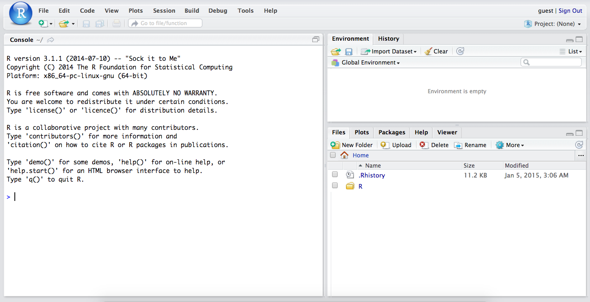

The goal of this lab is to introduce you to R and RStudio, which you'll be using throughout the course both to learn the statistical concepts discussed in the texbook and also to analyze real data and come to informed conclusions.  To straighten out which is which: R is the name of the programming language itself and RStudio is a convenient interface.

To get started, go to the [course webpage](http://bitly.com/sta104su15), and then click on the RStudio link on the upper right. You may be prompted to log in using your Net ID and password.

As the labs progress, you are encouraged to explore beyond what the labs dictate; a willingness to experiment will make you a much better programmer.  Before we get to that stage, however, you need to build some basic fluency in R.  Today we begin with the fundamental building blocks of R and RStudio: the interface, reading in data, and basic commands.



The panel in the upper right contains your *workspace* as well as a history of the commands that you've previously entered.  Any plots that you generate will show up in the panel in the lower right corner.

The panel on the left is where the action happens.  It's called the *console*.  Everytime you launch RStudio, it will have the same text at the top of the console telling you the version of R that you're running.  Below that information is the *prompt*.  As its name suggests, this prompt is really a request, a request for a command.  Initially, interacting with R is all about typing commands and interpreting the output. These commands and their syntax have evolved over decades (literally) and now provide what many users feel is a fairly natural way to access data and organize, describe, and invoke statistical computations.

To get you started, enter the following command at the R prompt (i.e. right after `>` on the console).  You can either type it in manually or copy and paste it from this document.

```{r load-abrbuthnot-data, eval=TRUE}
source("http://www.openintro.org/stat/data/arbuthnot.R")
```

This command instructs R to access the OpenIntro website and fetch some data: the Arbuthnot baptism counts for boys and girls. You should see that the workspace area in the upper righthand corner of the RStudio window now lists a data set called `arbuthnot` that has 82 observations on 3 variables. As you interact with R, you will create a series of objects. Sometimes you load them as we have done here, and sometimes you create them yourself as the byproduct of a computation or some analysis you have performed. Note that because you are accessing data from the web, this command (and the entire assignment) will work in a computer lab, in the library, or in your dorm room; anywhere you have access to the Internet.

## Creating a reproducible lab report

We will be using a markdown language, R Markdown, to type up the lab report. This allows you to complete your lab entirely in RStudio as well as ensuring reproducibility of your analysis and results. To help get you started we are providing a template for you. Use the following code to download this template:

```{r load-template, eval=FALSE}
download("https://stat.duke.edu/courses/Summer15/sta104.01-1/post/labs/sta104_lab0.Rmd", destfile = "sta104_lab0.Rmd")
```

You will see a new file called `sta104_lab0.Rmd` in the Files tab on the pane in the bottom right corner of your RStudio window. Click on the file name to open the file. All you need to do to complete the lab is to type up your **brief** answers and the R code (when necessary) in the spaces provided in the document. Earlier in the lab spaces are provided for you to enter R code chunks. Later in the lab you'll need to figure out whether code is needed to answer a particular question, and if so a new chunk can be inserted by clicking on the *Insert Chunk* button (dropdown menu under *Chunks* on the upper right corner of your markdown document).

Before you keep going type your team name, the name of the team member who is the "author" for the day, and the "discussants", who are the other team members present in lab today. Then click on *Knit HTML* and you'll see your document in a new pop-up window.

## The Data: Dr. Arbuthnot's Baptism Records

The Arbuthnot data set refers to Dr. John Arbuthnot, an 18<sup>th</sup> century physician, writer, and mathematician.  He was interested in the ratio of newborn boys to newborn girls, so he gathered the baptism records for children born in London for every year from 1629 to 1710.  We can take a look at the data by typing its name into the console.

```{r view-data, eval=FALSE}
arbuthnot
```

What you should see are four columns of numbers, each row representing a different year: the first entry in each row is simply the row number (an index we can use to access the data from individual years if we want), the second is the year, and the third and fourth are the numbers of boys and girls baptized that year, respectively. Use the scrollbar on the right side of the console window to examine the complete data set.

Printing out the entire dataset like this is often not a great idea, especially when the sample size is large. Instead we can look at the first few rows using

```{r head, eval=FALSE}
head(arbuthnot)
```

or the last few rows using

```{r tail, eval=FALSE}
tail(arbuthnot)
```

Note that the row numbers in the first column are not part of Arbuthnot's data. R adds them as part of its printout to help you make visual comparisons. You can think of them as the index that you see on the left side of a spreadsheet. In fact, the comparison to a spreadsheet will generally be helpful. R has stored Arbuthnot's data in a kind of spreadsheet or table called a *data frame*.

You can see the dimensions of this data frame by typing:

```{r dim-data, eval=TRUE}
dim(arbuthnot)
```

This command should output `[1] 82 3`, indicating that there are 82 rows and 3 columns (we'll get to what the `[1]` means in a bit), just as it says next to the object in your workspace. You can see the names of these columns (or variables) by typing:

```{r names-data, eval=TRUE}
names(arbuthnot)
```

You should see that the data frame contains the columns `year`,  `boys`, and `girls`. At this point, you might notice that many of the commands in R look a lot like functions from math class; that is, invoking R commands means supplying a function with some number of arguments. The `dim` and `names` commands, for example, each took a single argument, the name of a data frame. 

One advantage of RStudio is that it comes with a built-in data viewer. Click on the name `arbuthnot` in the *Environment* pane (upper right window) that lists the objects in your workspace. This will bring up an alternative display of the data set in the *Data Viewer* (upper left window). You can close the data viewer by clicking on the *x* in the upper lefthand corner.

## Some Exploration
Let's start to examine the data a little more closely. We can access the data in a single column of a data frame separately using a command like

```{r view-boys, eval=FALSE}
arbuthnot$boys
```

This command will only show the number of boys baptized each year.

1.  What command would you use to extract just the counts of girls baptized? Try it!

Notice that the way R has printed these data is different. When we looked at the complete data frame, we saw 82 rows, one on each line of the display. These data are no longer structured in a table with other variables, so they are displayed one right after another. Objects that print out in this way are called *vectors*; they represent a set of numbers. R has added numbers in [brackets] along the left side of the printout to indicate locations within the vector. For example, `5218` follows `[1]`, indicating that `5218` is the first entry in the vector. And if `[43]` starts a line, then that would mean the first number on that line would represent the 43<sup>rd</sup> entry in the vector.

R has some powerful functions for making graphics. We can create a simple plot of the number of girls baptized per year with the command

```{r plot-girls-vs-year, eval=FALSE}
plot(x = arbuthnot$year, y = arbuthnot$girls)
```

By default, R creates a scatterplot with each x,y pair indicated by an open circle. The plot itself should appear under the *Plots* tab of the lower right panel of RStudio. Notice that the command above again looks like a function, this time with two arguments separated by a comma.  The first argument in the plot function specifies the variable for the x-axis and the second for the y-axis. If we wanted to connect the data points with lines, we could add a third argument, the letter `l` for **l**ine.

```{r plot-girls-vs-year-line, eval=FALSE}
plot(x = arbuthnot$year, y = arbuthnot$girls, type = "l")
```

You might wonder how you are supposed to know that it was possible to add that third argument.  Thankfully, R documents all of its functions extensively. To read what a function does and learn the arguments that are available to you, just type in a question mark followed by the name of the function that you're interested in. Try the following.

```{r plot-help, eval=FALSE, tidy = FALSE}
?plot
```

Notice that the help file replaces the plot  in the lower right panel. You can toggle between plots and help files using the tabs at the top of that panel.

2.  Is there an apparent trend in the number of girls baptized over the years?  How would you describe it?

Now, suppose we want to plot the total number of baptisms.  To compute this, we could use the fact that R is really just a big calculator. We can type in mathematical expressions like

```{r calc-total-bapt-numbers, eval=FALSE}
5218 + 4683
```

to see the total number of baptisms in 1629. We could repeat this once for each year, but there is a faster way. If we add the vector for baptisms for boys and girls, R will compute all sums simultaneously.

```{r calc-total-bapt-vars, eval=FALSE}
arbuthnot$boys + arbuthnot$girls
```

What you will see are 82 numbers (in that packed display, because we aren't looking at a data frame here), each one representing the sum we're after. Take a look at a few of them and verify that they are right. Therefore, we can make a plot of the total number of baptisms per year with the command

```{r plot-total-vs-year, eval=FALSE}
plot(arbuthnot$year, arbuthnot$boys + arbuthnot$girls, type = "l")
```

This time, note that we left out the names of the first two arguments.  We can do this because the help file shows that the default for `plot` is for the first argument to be the x-variable and the second argument to be the y-variable.

Similarly to how we computed the proportion of boys, we can compute the ratio of the number of boys to the number of girls baptized in 1629 with

```{r calc-prop-boys-to-girls-numbers, eval=FALSE}
5218 / 4683
```

or we can act on the complete vectors with the expression

```{r calc-prop-boys-to-girls-vars, eval=FALSE}
arbuthnot$boys / arbuthnot$girls
```

The proportion of newborns that are boys

```{r calc-prop-boys-numbers, eval=FALSE}
5218 / (5218 + 4683)
```

or this may also be computed for all years simultaneously:

```{r calc-prop-boys-vars, eval=FALSE}
arbuthnot$boys / (arbuthnot$boys + arbuthnot$girls)
```

Note that with R as with your calculator, you need to be conscious of the order of operations.  Here, we want to divide the number of boys by the total number of newborns, so we have to use parentheses.  Without them, R will first do the division, then the addition, giving you something that is not a proportion.

3.  Now, make a plot of the proportion of boys over time. What do you see? Tip: If you use the up and down arrow keys, you can scroll through your previous commands, your so-called command history. You can also access it by clicking on the history tab in the upper right panel.  This will save you a lot of typing in the future.

Finally, in addition to simple mathematical operators like subtraction and division, you can ask R to make comparisons like greater than, `>`, less than, `<`, and equality, `==`. For example, we can ask if boys outnumber girls in each year with the expression

```{r boys-more-than-girls, eval=FALSE}
arbuthnot$boys > arbuthnot$girls
```

This command returns 82 values of either `TRUE` if that year had more boys than girls, or `FALSE` if that year did not (the answer may surprise you). This output shows a different kind of data than we have considered so far. In the `arbuthnot` data frame our values are numerical (the year, the number of boys and girls). Here, we've asked R to create *logical* data, data where the values are either `TRUE` or `FALSE`. In general, data analysis will involve many different kinds of data types, and one reason for using R is that it is able to represent and compute with many of them.

This seems like a fair bit for your first lab, so let's stop here. To exit RStudio you can click the *x* in the upper right corner of the whole window.  You will be prompted to save your workspace. If you click *save*, RStudio will save the history of your commands and all the objects in your workspace so that the next time you launch RStudio, you will see `arbuthnot` and you will have access to the commands you typed in your previous session. For now, click *save*, then start up RStudio again.

* * *

## On Your Own

<div class="oyo">

In this section you're "on your own", meaning that there is less handholding with the code. Using what you learned so far you are expected to be able to figure out the necessary code to answer the questions below. Of course, you are not really "on your own", as you're working in teams and you are welcomed and encouraged to ask questions to your TAs.

Earlier you recreated some of the displays and preliminary analysis of Arbuthnot's baptism data. Your assignment involves repeating these steps, but for present day birth records in the United States.  Load up the present day data with the following command.

```{r load-present-data, eval=FALSE}
source("http://www.openintro.org/stat/data/present.R")
```

The data are stored in a data frame called `present`.

* What years are included in this data set? What are the dimensions of the data frame and what are the variable or column names?

* How do these counts compare to Arbuthnot's? Are they on a similar scale?

* Make a plot that displays the boy-to-girl ratio for every year in the data set. What do
you see? Does Arbuthnot's observation about boys being born in greater proportion than girls
hold up in the U.S.? Include the plot in your response.

* In what year did we see the most total number of births in the U.S.? You can refer to the help files or the R reference card [http://cran.r-project.org/doc/contrib/Short-refcard.pdf](http://cran.r-project.org/doc/contrib/Short-refcard.pdf) to find helpful commands.

These data come from a report by the Centers for Disease Control [http://www.cdc.gov/nchs/data/nvsr/nvsr53/nvsr53_20.pdf](http://www.cdc.gov/nchs/data/nvsr/nvsr53/nvsr53_20.pdf). Check it out if you would like to read more about an analysis of sex ratios at birth in the United States.

That was a short introduction to R and RStudio, but we will provide you with more functions and a more complete sense of the language as the course progresses. Feel free to browse around the websites for [R](http://www.r-project.org) and [RStudio](http://rstudio.org) if you're interested in learning more, or see http://tryr.codeschool.com for a more advanced introduction to R.

</div>

* * *

## Submission

When you are done, export **both** the Rmd and the HTML files you created, and upload them to Sakai under the appropriate assignment. To export, check the box next to the Rmd and the HTML files for this lab, click on More, and then Export. This will download the files (likely to your Desktop or your Downloads folder, depending on your operating system and configurations). You can then upload these files to Sakai. Step-by-step instructions for exporting/submission can be found on the [course FAQ](https://stat.duke.edu/courses/Summer15/sta104.01-1/faq/#r5). Only one submission per team is required.

<div id="license">
This is a product of OpenIntro that is released under a [Creative Commons Attribution-ShareAlike 3.0 Unported](http://creativecommons.org/licenses/by-sa/3.0). This lab was adapted for OpenIntro by Andrew Bray and Mine &Ccedil;etinkaya-Rundel from a lab written by Mark Hansen of UCLA Statistics.
</div>